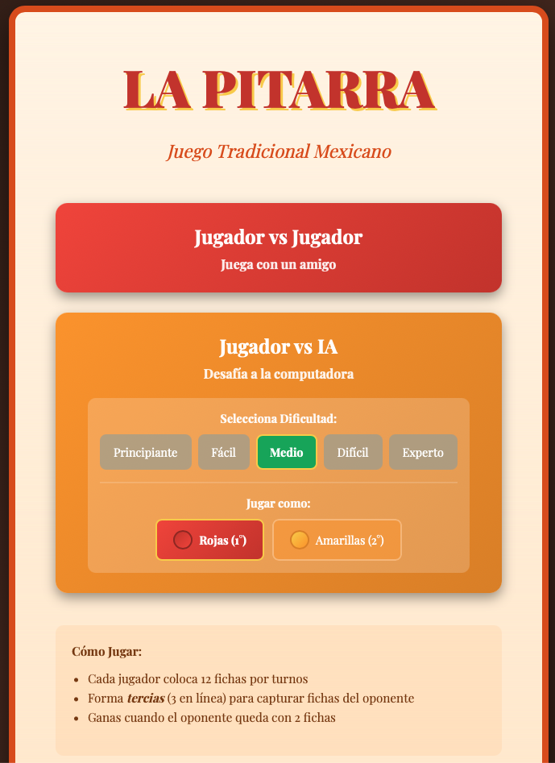
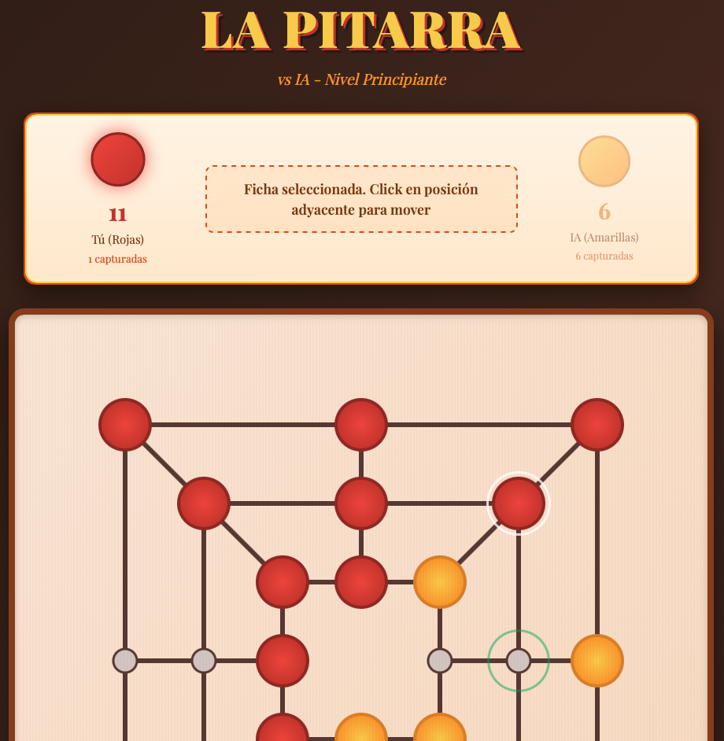
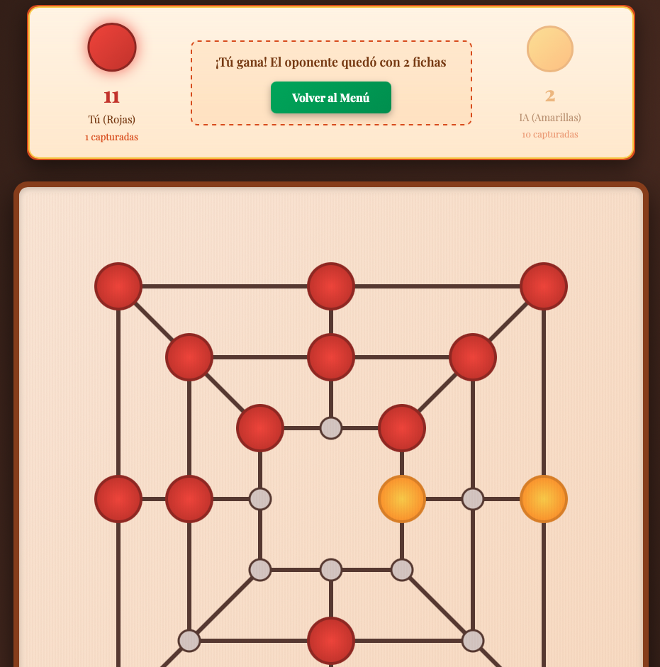

# La Pitarra 🎮

Traditional Mexican board game with advanced AI opponent

[]()
[]()
[]()

## 🎯 About The Project

La Pitarra is a traditional Mexican board game (similar to Nine Men's Morris) featuring an advanced AI opponent built with the Minimax algorithm. This project demonstrates expertise in algorithm design, game theory, and modern web technologies.

### ✨ Key Features

- 🔴🟡 **Dynamic Color Selection** - Choose to play first (red) or second (yellow)
- 🤖 **5 AI Difficulty Levels** - From beginner to expert (Minimax depth 3-18)
- 📱 **Progressive Web App** - Installable on iOS/Android, works 100% offline
- ⚡ **Optimized Performance** - Response time: 4-60 seconds on mobile devices
- 🎨 **Responsive Design** - Works seamlessly on desktop and mobile

## 📸 Screenshots

### Main Menu


### Color Selection


### Gameplay - Placement Phase


### Gameplay - Movement Phase


### Victory Screen


## 🧠 Technical Highlights

### Algorithm & AI

- **Algorithm:** Minimax with Alpha-Beta pruning
- **Optimization:** Transposition tables, move ordering
- **Adaptive Depth:** 3-18 levels based on game phase
- **Performance:** Prunes 85-95% of search tree
- **Evaluation:** Sophisticated heuristic function

### Architecture

# La Pitarra 🎮

Traditional Mexican board game with advanced AI opponent

[]()
[]()
[]()

## 🎯 About The Project

La Pitarra is a traditional Mexican board game (similar to Nine Men's Morris) featuring an advanced AI opponent built with the Minimax algorithm. This project demonstrates expertise in algorithm design, game theory, and modern web technologies.

### ✨ Key Features

- 🔴🟡 **Dynamic Color Selection** - Choose to play first (red) or second (yellow)
- 🤖 **5 AI Difficulty Levels** - From beginner to expert (Minimax depth 3-18)
- 📱 **Progressive Web App** - Installable on iOS/Android, works 100% offline
- ⚡ **Optimized Performance** - Response time: 4-60 seconds on mobile devices
- 🎨 **Responsive Design** - Works seamlessly on desktop and mobile

## 📸 Screenshots

### Main Menu


### Color Selection


### Gameplay - Placement Phase


### Gameplay - Movement Phase


### Victory Screen


## 🧠 Technical Highlights

### Algorithm & AI

- **Algorithm:** Minimax with Alpha-Beta pruning
- **Optimization:** Transposition tables, move ordering
- **Adaptive Depth:** 3-18 levels based on game phase
- **Performance:** Prunes 85-95% of search tree
- **Evaluation:** Sophisticated heuristic function

### Architecture
```
┌─────────────────────────────────────┐
│         Game Interface              │
│  (React Components + State Mgmt)    │
└─────────────┬───────────────────────┘
              │
┌─────────────┴───────────────────────┐
│         Game Engine                 │
│  • Move validation                  │
│  • Tercia (3-in-a-row) detection    │
│  • Win condition checking           │
└─────────────┬───────────────────────┘
              │
┌─────────────┴───────────────────────┐
│         AI Engine                   │
│  • Minimax with α-β pruning         │
│  • Transposition table              │
│  • Position evaluation              │
│  • Move generation & ordering       │
└─────────────────────────────────────┘
```

### Technology Stack

| Layer             | Technology                         |
|-------------------|------------------------------------|
| Frontend          | React 18                           |
| PWA               | Service Workers, Web App Manifest  |
| Offline Support   | Cache API                          |
| Deployment        | Standalone (no build required)     |

## 📊 AI Performance Metrics

### Difficulty Levels

| Level | Name     | Algorithm                   | Depth | Response Time* |
|-------|----------|-----------------------------|-------|----------------|
| 1     | Beginner | Random                      | -     | Instant  |
| 2     | Easy     | Basic heuristics            | 2-3   | 1-2s     |
| 3     | Medium   | Minimax                     | 6-8   | 2-5s     |
| 4     | Hard     | Minimax + optimizations     | 8-10  | 5-15s    |
| 5     | Expert   | Minimax + full optimization | 10-18 | 10-60s   |

_*Response times on iPhone 14 Pro_

### Performance Optimizations

- ✅ **Alpha-Beta Pruning** - Reduces search space by 85-95%
- ✅ **Transposition Tables** - Avoids recalculating identical positions
- ✅ **Move Ordering** - Evaluates best moves first
- ✅ **Adaptive Depth** - Deeper search in endgame (fewer pieces)
- ✅ **Early Termination** - Immediate return on forced wins

## 🎲 Game Rules

### Objective
Leave opponent with only 2 pieces or no valid moves

### Game Phases

**Phase 1: Placement**
- Each player places their 12 pieces on the board
- One piece per turn
- Place on any empty position

**Phase 2: Movement**
- Move pieces to adjacent empty positions
- Only orthogonal moves (no diagonals)

### Tercia (3-in-a-row)
- Form 3 pieces in a line (horizontal, vertical, or diagonal)
- Capture one opponent piece when tercia is formed
- Captured piece is removed from the board

### Victory Conditions
- Opponent has 2 pieces remaining
- Opponent has no valid moves

## 📱 Progressive Web App Features

### Installation
- **iOS (Safari):** Share → Add to Home Screen
- **Android (Chrome):** Install banner or Menu → Add to Home Screen

### Offline Capabilities
- ✅ Full game functionality
- ✅ All AI levels work offline
- ✅ No network required after installation
- ✅ Survives device restart

## 📈 Project Statistics

- **Development Time:** ~40 hours (including AI optimization)
- **Lines of Code:** ~1,900 (single-file implementation)
- **AI Iterations:** 5 major versions
- **Test Positions Evaluated:** 1M+ during optimization
- **File Size:** 85 KB (uncompressed)

## 💼 Technical Skills Demonstrated

### Algorithm Design
- Minimax with alpha-beta pruning
- Transposition tables for memoization
- Heuristic evaluation functions
- Performance optimization techniques

### Frontend Development
- React 18 with Hooks
- Progressive Web App implementation
- Service Workers for offline functionality
- Responsive design patterns

### Software Engineering
- Clean code architecture
- Performance profiling and optimization
- Cross-platform compatibility
- Mobile-first development

## 🔐 Source Code

**Note:** The source code for this project is private to protect intellectual property.

This repository contains:
- ✅ Project documentation
- ✅ Architecture overview
- ✅ Technical specifications
- ✅ Screenshots and demos
- ❌ Source code (proprietary)

For collaboration, licensing inquiries, or demo requests:
📧 emmanuelbenitez.pm@gmail.com

## 🤝 About the Developer

**Emmanuel Benitez**  
Senior Technical Project Manager | Cloud & Data Programs

- 💼 [LinkedIn](https://www.linkedin.com/in/emmanuel-benitez-pm)
- 🐙 [GitHub](https://github.com/emmanuelbenitez-pm)
- 📍 Mexico City, Mexico

### Skills Demonstrated in This Project
- Advanced algorithm implementation
- React and modern JavaScript
- Progressive Web Apps
- Performance optimization
- Mobile-first development
- Cross-platform compatibility

## 📝 Project Context

This project was developed as a personal technical challenge to:
- Explore advanced game AI algorithms
- Practice React and PWA development
- Preserve a traditional Mexican game
- Demonstrate technical capabilities for portfolio

---

**Built with ❤️ in Mexico City**

_Last updated: January 2026_

---

## 🎯 Related Projects

Explore my other work:
- [PM Templates & Automation](https://github.com/emmanuelbenitez-pm/pm-templates) - Project management tools
- [AWS Study Notes](https://github.com/emmanuelbenitez-pm/aws-study-notes) - Cloud architecture learning (coming soon)
